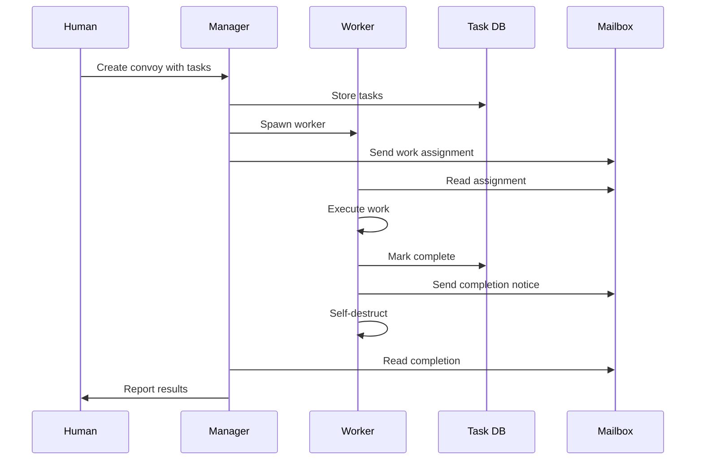

# Simple Gas Town: Python Implementation Design

> **Complete standalone design document for building a simplified Gas Town-inspired multi-agent system**
> 
> This document contains everything you need to build the system from scratch with no reference to the original Gas Town codebase.

## Table of Contents

1. [Core Concepts](#core-concepts)
2. [System Architecture](#system-architecture)
3. [Data Models](#data-models)
4. [File Structure](#file-structure)
5. [Implementation Phases](#implementation-phases)
6. [Detailed Component Specifications](#detailed-component-specifications)
7. [CLI Commands](#cli-commands)
8. [Integration with GitHub Copilot](#integration-with-github-copilot)
9. [Example Workflows](#example-workflows)

---

## Core Concepts

### The Gas Town Philosophy

Gas Town is built on **persistent, observable multi-agent coordination**:

1. **Agents are workers** - Each agent has a specific role and workspace
2. **State persists on disk** - Everything survives crashes and restarts
3. **Communication via mailboxes** - File-based message passing between agents
4. **Work is tracked as issues** - Every task is a structured data object
5. **Git-backed isolation** - Each agent works in its own workspace
6. **Propulsion Principle** - When work is assigned to an agent (hooked), they execute immediately without confirmation

### Key Entities

| Entity | Description | Lifecycle |
|--------|-------------|-----------|
| **Manager** | Central coordinator (like "Mayor") | Persistent, user-controlled |
| **Worker** | Ephemeral task executor (like "Polecat") | Spawned for task, self-destructs when done |
| **Task** | A unit of work (like "Issue/Bead") | Created → Assigned → Completed |
| **Convoy** | Batch of related tasks tracked together | Created → Active → Landed |
| **Mailbox** | Agent's message inbox | Directory with JSON messages |
| **Hook** | Agent's current work assignment | JSON file in agent's workspace |
| **Workspace** | Agent's isolated work directory | Created with agent, cleaned on exit |

### Three Agent Types (Simplified)

1. **Manager** - Human-controlled coordinator
   - Creates tasks and convoys
   - Assigns work to workers
   - Monitors overall progress
   - Persistent (long-lived)

2. **Worker** - Autonomous executor
   - Receives work assignments via mailbox
   - Executes tasks in isolated workspace
   - Reports completion
   - Ephemeral (self-destructs after completion)

3. **Supervisor** (Optional for Phase 2)
   - Monitors worker health
   - Sends reminders/nudges
   - Handles stuck workers
   - Persistent background process

---

## System Architecture

### Directory Structure

```
~/simple-gastown/           # Town root
├── .gastown/               # System config
│   └── config.json         # Global settings
│
├── manager/                # Manager workspace
│   ├── INSTRUCTIONS.md     # Manager system prompt
│   └── mailbox/            # Manager's inbox
│       └── *.json          # Messages
│
├── projects/               # All project repositories
│   └── my-project/         # A project (git repo)
│       ├── .git/           # Git repository
│       ├── .tasks/         # Task tracking
│       │   ├── tasks.json  # All tasks
│       │   └── convoy.json # Convoy tracking
│       │
│       ├── workers/        # Active workers
│       │   └── worker-001/ # A worker's workspace
│       │       ├── INSTRUCTIONS.md
│       │       ├── hook.json       # Current assignment
│       │       ├── mailbox/        # Inbox
│       │       ├── state.json      # Worker state
│       │       └── workspace/      # Git worktree
│       │
│       └── settings/       # Project config
│           └── config.json
│
└── state/                  # Global state
    ├── agents.json         # All active agents
    ├── convoys.json        # Active convoys
    └── logs/               # Activity logs
        └── YYYY-MM-DD.jsonl
```

### Communication Flow



### State Persistence Strategy

**Everything is JSON files on disk:**

1. **Agent State** - `state/agents.json`
   - Who's running, what they're working on
   - Updated atomically on state changes

2. **Task State** - `projects/<project>/.tasks/tasks.json`
   - All tasks for a project
   - Task status, assignee, results

3. **Convoy State** - `state/convoys.json`
   - Tracking batches of work
   - Which tasks belong to which convoy

4. **Messages** - `<agent>/mailbox/*.json`
   - One file per message
   - Deleted when read (or moved to archive)

5. **Hooks** - `<agent>/hook.json`
   - Current work assignment
   - Cleared on completion

---

## Data Models

### Task (Issue/Bead Equivalent)

```python
{
    "id": "task-abc123",          # Unique identifier
    "title": "Fix parser bug",    # Human-readable title
    "description": "...",          # Detailed description
    "status": "open",              # open, in_progress, completed, failed
    "priority": "high",            # high, normal, low
    "project": "my-project",       # Which project
    "assignee": null,              # Who's working on it
    "created_at": "2026-01-12T10:00:00Z",
    "updated_at": "2026-01-12T10:00:00Z",
    "completed_at": null,
    "result": null,                # Completion summary
    "convoy_id": null              # Optional: convoy tracking this
}
```

### Convoy (Work Batch)

```python
{
    "id": "convoy-xyz789",
    "name": "Auth System Feature",
    "status": "active",            # active, completed
    "tasks": [                     # List of task IDs
        "task-abc123",
        "task-def456"
    ],
    "created_at": "2026-01-12T10:00:00Z",
    "completed_at": null,
    "notify": ["manager"]          # Who to notify on completion
}
```

### Agent State

```python
{
    "id": "worker-001",
    "type": "worker",              # manager, worker, supervisor
    "status": "running",           # idle, running, completed, failed
    "project": "my-project",
    "task_id": "task-abc123",      # Currently working on
    "workspace": "/path/to/workspace",
    "started_at": "2026-01-12T10:01:00Z",
    "last_heartbeat": "2026-01-12T10:05:00Z",
    "mailbox_path": "/path/to/mailbox"
}
```

### Message

```python
{
    "id": "msg-001",
    "from": "manager",             # Sender identity
    "to": "worker-001",            # Recipient identity
    "subject": "Work Assignment",
    "body": "Please work on task-abc123",
    "sent_at": "2026-01-12T10:01:00Z",
    "read": false,
    "metadata": {                  # Optional structured data
        "task_id": "task-abc123",
        "priority": "high"
    }
}
```

### Hook (Work Assignment)

```python
{
    "task_id": "task-abc123",
    "assigned_at": "2026-01-12T10:01:00Z",
    "assigned_by": "manager",
    "instructions": "Focus on error handling",  # Optional natural language
    "priority": "high"
}
```

---

## File Structure

```
simple-gastown/
├── pyproject.toml           # Project config
├── requirements.txt         # Dependencies
├── README.md
│
├── sgt                      # CLI entry script (chmod +x)
│
├── sgt/                     # Main package
│   ├── __init__.py
│   ├── __main__.py         # Entry point
│   │
│   ├── cli/                # Command-line interface
│   │   ├── __init__.py
│   │   ├── main.py         # CLI router
│   │   ├── convoy.py       # Convoy commands
│   │   ├── task.py         # Task commands
│   │   ├── worker.py       # Worker commands
│   │   └── manager.py      # Manager commands
│   │
│   ├── core/               # Core business logic
│   │   ├── __init__.py
│   │   ├── agent_manager.py    # Agent lifecycle
│   │   ├── task_manager.py     # Task management
│   │   ├── convoy_manager.py   # Convoy tracking
│   │   └── workspace.py        # Workspace management
│   │
│   ├── agents/             # Agent implementations
│   │   ├── __init__.py
│   │   ├── base.py         # Base agent class
│   │   ├── worker.py       # Worker agent
│   │   └── manager.py      # Manager agent
│   │
│   ├── storage/            # Persistence layer
│   │   ├── __init__.py
│   │   ├── state.py        # State management
│   │   ├── mailbox.py      # Message passing
│   │   └── hooks.py        # Work assignment
│   │
│   ├── llm/                # LLM integrations
│   │   ├── __init__.py
│   │   ├── base.py         # Base LLM client
│   │   ├── openai_client.py    # OpenAI
│   │   └── anthropic_client.py # Claude
│   │
│   ├── git/                # Git operations
│   │   ├── __init__.py
│   │   └── worktree.py     # Worktree management
│   │
│   └── utils/              # Utilities
│       ├── __init__.py
│       ├── ids.py          # ID generation
│       ├── logger.py       # Logging
│       └── process.py      # Process management
│
└── tests/                  # Tests
    ├── test_agent_manager.py
    ├── test_task_manager.py
    └── test_mailbox.py
```

---

## Implementation Phases

### Phase 1: Core Foundation (Days 1-3)

**Goal:** Basic task and agent management without LLM integration

**Features:**
- Create/list/update tasks
- Create/list convoys
- Spawn/list/kill workers (dummy execution)
- Mailbox message passing
- State persistence

**Deliverables:**
- CLI that can create tasks
- CLI that can spawn workers
- Workers read mailbox and update task status
- All state persists to JSON files

**No LLM required yet** - Workers just print "Working on task" and mark complete

### Phase 2: Git Integration (Days 4-5)

**Goal:** Isolated workspaces for each worker

**Features:**
- Git worktree creation per worker
- Workers work in isolated directories
- Automatic cleanup on worker exit

**Deliverables:**
- Each worker gets its own git worktree
- Workers can make changes without conflicts
- `sgt worker list` shows workspace paths

### Phase 3: LLM Integration (Days 6-8)

**Goal:** Workers use LLM to actually complete tasks

**Features:**
- Integration with OpenAI/Anthropic APIs
- System prompts for workers
- Task context in prompts
- Result extraction

**Deliverables:**
- Workers use GitHub Copilot API or OpenAI
- Workers generate actual code changes
- Results stored in task completion

### Phase 4: Supervisor & Monitoring (Days 9-10)

**Goal:** Health checks and automatic recovery

**Features:**
- Supervisor agent monitors workers
- Heartbeat checking
- Automatic nudges for stuck workers
- Worker timeout and restart

**Deliverables:**
- Background supervisor process
- `sgt supervisor start/stop`
- Automatic worker recovery

---

## Detailed Component Specifications

### 1. CLI Entry Point

**File:** `sgt/cli/main.py`

```python
import click

@click.group()
@click.version_option()
def cli():
    """Simple Gas Town - Multi-agent task orchestration"""
    pass

# Subcommands
cli.add_command(convoy_commands)
cli.add_command(task_commands)
cli.add_command(worker_commands)
cli.add_command(manager_commands)

def main():
    return cli()
```

### 2. Task Manager

**File:** `sgt/core/task_manager.py`

**Responsibilities:**
- Create/read/update/delete tasks
- Assign tasks to workers
- Track task status
- Store in JSON file

**Key Methods:**
```python
class TaskManager:
    def __init__(self, project_path: Path):
        self.project_path = project_path
        self.tasks_file = project_path / ".tasks" / "tasks.json"
    
    def create_task(self, title: str, description: str, 
                   priority: str = "normal") -> Task:
        """Create a new task"""
        
    def assign_task(self, task_id: str, worker_id: str) -> None:
        """Assign task to a worker"""
        
    def complete_task(self, task_id: str, result: str) -> None:
        """Mark task as completed with result"""
        
    def list_tasks(self, status: str = None) -> List[Task]:
        """List all tasks, optionally filtered by status"""
```

### 3. Agent Manager

**File:** `sgt/core/agent_manager.py`

**Responsibilities:**
- Spawn/kill agents
- Track agent state
- Manage agent lifecycle
- Store in JSON file

**Key Methods:**
```python
class AgentManager:
    def __init__(self, town_root: Path):
        self.town_root = town_root
        self.state_file = town_root / "state" / "agents.json"
    
    def spawn_worker(self, project: str, task_id: str) -> Worker:
        """Spawn a new worker for a task"""
        # 1. Generate unique worker ID
        # 2. Create workspace directory
        # 3. Create git worktree (Phase 2)
        # 4. Write INSTRUCTIONS.md
        # 5. Create hook.json with task assignment
        # 6. Send mailbox message
        # 7. Start worker process in background
        # 8. Update state file
        
    def kill_worker(self, worker_id: str) -> None:
        """Terminate a worker and clean up"""
        
    def list_workers(self) -> List[AgentState]:
        """List all active workers"""
        
    def update_heartbeat(self, worker_id: str) -> None:
        """Update worker's last heartbeat timestamp"""
```

### 4. Mailbox System

**File:** `sgt/storage/mailbox.py`

**Responsibilities:**
- Send messages between agents
- Read messages from mailbox
- Archive/delete read messages

**Key Methods:**
```python
class Mailbox:
    def __init__(self, mailbox_path: Path):
        self.path = mailbox_path
        self.path.mkdir(parents=True, exist_ok=True)
    
    def send(self, message: Message) -> None:
        """Write message to recipient's mailbox"""
        msg_file = self.path / f"{message.id}.json"
        with open(msg_file, 'w') as f:
            json.dump(message.dict(), f, indent=2)
    
    def read_all(self) -> List[Message]:
        """Read all unread messages"""
        messages = []
        for msg_file in self.path.glob("*.json"):
            with open(msg_file) as f:
                messages.append(Message(**json.load(f)))
        return sorted(messages, key=lambda m: m.sent_at)
    
    def mark_read(self, message_id: str) -> None:
        """Delete or archive a message"""
        msg_file = self.path / f"{message_id}.json"
        if msg_file.exists():
            msg_file.unlink()
```

### 5. Worker Agent

**File:** `sgt/agents/worker.py`

**Responsibilities:**
- Read work assignment from hook
- Execute task using LLM (Phase 3)
- Report completion
- Self-destruct when done

**Key Methods:**
```python
class Worker:
    def __init__(self, worker_id: str, workspace: Path):
        self.id = worker_id
        self.workspace = workspace
        self.hook_file = workspace / "hook.json"
        self.mailbox = Mailbox(workspace / "mailbox")
        self.state_file = workspace / "state.json"
    
    async def run(self) -> None:
        """Main worker loop"""
        # 1. Load hook to get task assignment
        hook = self.load_hook()
        if not hook:
            raise ValueError("No work assignment found")
        
        # 2. Load task details
        task = self.load_task(hook['task_id'])
        
        # 3. Update state to 'running'
        self.update_state('running', task.id)
        
        # 4. Execute task (Phase 1: just sleep, Phase 3: use LLM)
        result = await self.execute_task(task)
        
        # 5. Mark task complete
        self.complete_task(task.id, result)
        
        # 6. Send completion message to manager
        self.send_completion_message(task.id, result)
        
        # 7. Update state to 'completed'
        self.update_state('completed', task.id)
        
        # 8. Self-destruct (cleanup workspace)
        self.cleanup()
    
    async def execute_task(self, task: Task) -> str:
        """Execute the task (Phase 3: LLM integration)"""
        # Phase 1: Just simulate work
        await asyncio.sleep(5)
        return "Task completed (simulated)"
        
        # Phase 3: Use LLM
        # llm = LLMClient()
        # prompt = self.build_prompt(task)
        # result = await llm.complete(prompt)
        # return result
```

### 6. Convoy Manager

**File:** `sgt/core/convoy_manager.py`

**Responsibilities:**
- Create convoys (work batches)
- Track convoy progress
- Auto-close when all tasks complete
- Notify on completion

**Key Methods:**
```python
class ConvoyManager:
    def __init__(self, town_root: Path):
        self.town_root = town_root
        self.convoys_file = town_root / "state" / "convoys.json"
    
    def create_convoy(self, name: str, task_ids: List[str],
                     notify: List[str] = None) -> Convoy:
        """Create a new convoy tracking multiple tasks"""
        
    def check_convoy_completion(self, convoy_id: str) -> bool:
        """Check if all tasks in convoy are complete"""
        
    def complete_convoy(self, convoy_id: str) -> None:
        """Mark convoy as complete and send notifications"""
```

### 7. Git Worktree Management (Phase 2)

**File:** `sgt/git/worktree.py`

**Responsibilities:**
- Create git worktrees for workers
- Clean up worktrees on worker exit

**Key Methods:**
```python
class GitWorktree:
    def __init__(self, repo_path: Path):
        self.repo = repo_path
    
    def create_worktree(self, worker_id: str) -> Path:
        """Create a git worktree for worker"""
        branch = f"worker-{worker_id}"
        worktree_path = self.repo / "workers" / worker_id / "workspace"
        
        # git worktree add <path> -b <branch>
        subprocess.run([
            "git", "worktree", "add",
            str(worktree_path), "-b", branch
        ], cwd=self.repo, check=True)
        
        return worktree_path
    
    def remove_worktree(self, worker_id: str) -> None:
        """Remove worker's worktree"""
        worktree_path = self.repo / "workers" / worker_id / "workspace"
        
        # git worktree remove <path>
        subprocess.run([
            "git", "worktree", "remove", str(worktree_path)
        ], cwd=self.repo, check=True)
```

### 8. LLM Client (Phase 3)

**File:** `sgt/llm/openai_client.py`

**Responsibilities:**
- Interface with LLM APIs
- Build prompts with task context
- Parse responses

**Key Methods:**
```python
class OpenAIClient:
    def __init__(self, api_key: str = None):
        self.api_key = api_key or os.environ["OPENAI_API_KEY"]
        self.client = openai.AsyncClient(api_key=self.api_key)
    
    async def complete(self, system_prompt: str, user_prompt: str,
                      model: str = "gpt-4") -> str:
        """Get completion from OpenAI"""
        response = await self.client.chat.completions.create(
            model=model,
            messages=[
                {"role": "system", "content": system_prompt},
                {"role": "user", "content": user_prompt}
            ]
        )
        return response.choices[0].message.content
```

---

## CLI Commands

### Core Commands (Phase 1)

```bash
# Initialize system
sgt init ~/my-gastown           # Create town structure
sgt project add my-project      # Add a project (git repo)

# Task management
sgt task create "Fix parser bug" --priority high
sgt task list                   # List all tasks
sgt task show task-abc123       # Show task details
sgt task update task-abc123 --status in_progress

# Convoy management
sgt convoy create "Auth Feature" task-abc123 task-def456
sgt convoy list                 # List active convoys
sgt convoy status convoy-xyz789 # Check convoy progress

# Worker management
sgt worker spawn task-abc123    # Spawn worker for task
sgt worker list                 # List active workers
sgt worker kill worker-001      # Terminate worker
sgt worker logs worker-001      # View worker logs

# Assignment (combined operation)
sgt assign task-abc123          # Create task assignment
                                # = spawn worker + assign + hook
```

### Advanced Commands (Phase 2+)

```bash
# Supervisor
sgt supervisor start            # Start supervisor daemon
sgt supervisor stop             # Stop supervisor
sgt supervisor status           # Check supervisor health

# Batch operations
sgt assign --convoy "Feature X" task-001 task-002 task-003

# Monitoring
sgt status                      # Overall system status
sgt dashboard                   # Interactive TUI (optional)
```

---

## Integration with GitHub Copilot

### How Workers Use LLMs

**Phase 3 Implementation:**

Workers are spawned with:
1. **System Prompt** (`INSTRUCTIONS.md`) defining their role
2. **Task Context** from hook.json
3. **Workspace** to make changes

**For GitHub Copilot Chat API:**

```python
async def execute_task(self, task: Task) -> str:
    """Execute task using GitHub Copilot"""
    
    # Build system prompt
    system_prompt = self.load_instructions()
    
    # Build user prompt with task details
    user_prompt = f"""
You are a worker agent assigned to complete this task:

Title: {task.title}
Description: {task.description}
Priority: {task.priority}

Workspace: {self.workspace}

Please complete the task by:
1. Analyzing the requirements
2. Making necessary code changes
3. Testing your changes
4. Providing a summary of what you did

Begin execution now.
"""
    
    # Call LLM API
    result = await self.llm_client.complete(system_prompt, user_prompt)
    
    return result
```

**Worker INSTRUCTIONS.md Template:**

```markdown
# Worker Agent Instructions

You are an autonomous worker agent in Simple Gas Town.

## Your Role

You execute tasks assigned to you in an isolated workspace. Your job is to:
1. Read your task assignment from hook.json
2. Complete the task fully and correctly
3. Report results
4. Self-terminate when done

## Working Environment

- Workspace: {workspace_path}
- Task ID: {task_id}
- Project: {project_name}

## Task Execution Process

1. **Understand the task** - Read description and requirements
2. **Plan your approach** - Break down into steps
3. **Implement changes** - Write code, fix bugs, add features
4. **Verify your work** - Test that it works
5. **Document results** - Summarize what you did

## Important Rules

- Work ONLY in your workspace directory
- Do NOT modify files outside your workspace
- Do NOT start other workers or agents
- Complete your task and exit immediately
- If you encounter a blocker, report it in results

## On Completion

When you finish:
1. Write a clear summary of what you did
2. Mark the task as complete
3. Send completion message to manager
4. Exit (self-destruct)

Your work is permanent and attributed to you. Execute with care.
```

---

## Example Workflows

### Workflow 1: Single Task

```bash
# 1. Initialize
sgt init ~/demo-gastown
cd ~/demo-gastown
sgt project add my-app https://github.com/user/my-app.git

# 2. Create a task
sgt task create "Add user authentication" \
    --description "Implement JWT-based auth" \
    --priority high

# Output: Created task-abc123

# 3. Assign work (spawns worker automatically)
sgt assign task-abc123

# Output: 
# Spawned worker-001
# Assigned task-abc123 to worker-001
# Worker started in background

# 4. Monitor progress
sgt worker list

# Output:
# ID          STATUS    TASK         STARTED
# worker-001  running   task-abc123  2m ago

# 5. Check completion
sgt task show task-abc123

# Output:
# ID: task-abc123
# Title: Add user authentication
# Status: completed
# Result: Implemented JWT auth with login/logout endpoints

# Worker auto-terminates and cleans up workspace
```

### Workflow 2: Convoy (Batch Work)

```bash
# 1. Create multiple tasks
sgt task create "Setup database schema" --priority high
sgt task create "Add user model" --priority high
sgt task create "Create auth endpoints" --priority high

# Output: task-001, task-002, task-003

# 2. Create convoy
sgt convoy create "Auth System" task-001 task-002 task-003

# Output: Created convoy-xyz789

# 3. Assign all tasks (spawns 3 workers)
sgt assign --convoy convoy-xyz789

# Output:
# Spawned 3 workers for convoy-xyz789
# worker-001 → task-001
# worker-002 → task-002
# worker-003 → task-003

# 4. Monitor convoy
sgt convoy status convoy-xyz789

# Output:
# Convoy: Auth System
# Status: active
# Progress: 2/3 tasks complete
# 
# Tasks:
# ✓ task-001 (completed)
# ✓ task-002 (completed)
# ⏳ task-003 (in progress)

# When all tasks complete, convoy auto-closes
# and sends notification to manager
```

### Workflow 3: Interactive Development

```bash
# Developer in manager workspace
cd ~/demo-gastown/manager

# Create task
sgt task create "Fix null pointer bug in parser.go"

# Assign and watch
sgt assign task-abc123 --watch

# Output shows worker progress in real-time:
# [worker-001] Reading task assignment...
# [worker-001] Analyzing parser.go...
# [worker-001] Found null pointer in line 42...
# [worker-001] Applying fix...
# [worker-001] Running tests...
# [worker-001] Tests passed ✓
# [worker-001] Task completed
# [worker-001] Self-terminating...

# Check the result
sgt task show task-abc123

# Review changes in project
cd ~/demo-gastown/projects/my-app
git log
```

---

## State File Examples

### agents.json

```json
{
  "agents": [
    {
      "id": "manager",
      "type": "manager",
      "status": "idle",
      "workspace": "/home/user/demo-gastown/manager",
      "mailbox_path": "/home/user/demo-gastown/manager/mailbox"
    },
    {
      "id": "worker-001",
      "type": "worker",
      "status": "running",
      "project": "my-app",
      "task_id": "task-abc123",
      "workspace": "/home/user/demo-gastown/projects/my-app/workers/worker-001",
      "started_at": "2026-01-12T10:01:00Z",
      "last_heartbeat": "2026-01-12T10:05:00Z",
      "mailbox_path": "/home/user/demo-gastown/projects/my-app/workers/worker-001/mailbox"
    }
  ]
}
```

### tasks.json

```json
{
  "tasks": [
    {
      "id": "task-abc123",
      "title": "Add user authentication",
      "description": "Implement JWT-based auth system",
      "status": "in_progress",
      "priority": "high",
      "project": "my-app",
      "assignee": "worker-001",
      "created_at": "2026-01-12T10:00:00Z",
      "updated_at": "2026-01-12T10:01:00Z",
      "completed_at": null,
      "result": null,
      "convoy_id": null
    }
  ]
}
```

### convoys.json

```json
{
  "convoys": [
    {
      "id": "convoy-xyz789",
      "name": "Auth System",
      "status": "active",
      "tasks": ["task-abc123", "task-def456"],
      "created_at": "2026-01-12T10:00:00Z",
      "completed_at": null,
      "notify": ["manager"]
    }
  ]
}
```

---

## Testing Strategy

### Unit Tests

```python
# tests/test_task_manager.py
def test_create_task():
    tm = TaskManager(tmp_path)
    task = tm.create_task("Test task", "Description")
    assert task.id.startswith("task-")
    assert task.status == "open"

def test_assign_task():
    tm = TaskManager(tmp_path)
    task = tm.create_task("Test", "Desc")
    tm.assign_task(task.id, "worker-001")
    updated = tm.get_task(task.id)
    assert updated.assignee == "worker-001"
```

### Integration Tests

```python
# tests/test_worker_lifecycle.py
@pytest.mark.asyncio
async def test_worker_completes_task():
    # Setup
    tm = TaskManager(tmp_path)
    am = AgentManager(tmp_path)
    task = tm.create_task("Test", "Desc")
    
    # Spawn worker
    worker = am.spawn_worker("test-project", task.id)
    
    # Wait for completion
    await asyncio.sleep(10)
    
    # Verify
    updated_task = tm.get_task(task.id)
    assert updated_task.status == "completed"
    assert worker.id not in [a.id for a in am.list_workers()]
```

---

## Dependencies

**requirements.txt:**

```txt
# CLI
click>=8.1.0
rich>=13.0.0              # Beautiful terminal output

# Async
aiofiles>=23.0.0
aiohttp>=3.9.0

# LLM APIs (Phase 3)
openai>=1.0.0             # OpenAI/GitHub Copilot
anthropic>=0.18.0         # Claude

# Data validation
pydantic>=2.0.0

# Utils
python-dotenv>=1.0.0      # Environment variables
```

**pyproject.toml:**

```toml
[project]
name = "simple-gastown"
version = "0.1.0"
description = "Simplified multi-agent orchestration system"
requires-python = ">=3.10"

dependencies = [
    "click>=8.1.0",
    "rich>=13.0.0",
    "aiofiles>=23.0.0",
    "openai>=1.0.0",
    "pydantic>=2.0.0",
    "python-dotenv>=1.0.0",
]

[project.scripts]
sgt = "sgt.cli.main:main"

[project.optional-dependencies]
dev = [
    "pytest>=7.0.0",
    "pytest-asyncio>=0.21.0",
    "black>=23.0.0",
    "ruff>=0.1.0",
]
```

---

## Next Steps for Implementation

### Day 1: Project Setup

1. Create project structure
2. Set up pyproject.toml and dependencies
3. Implement basic CLI with Click
4. Create data models with Pydantic

### Day 2: Core Managers

1. Implement TaskManager (create, list, update)
2. Implement AgentManager (spawn, list, kill)
3. Add state persistence to JSON
4. Test basic operations

### Day 3: Communication

1. Implement Mailbox system
2. Implement Hook system
3. Add message passing between agents
4. Test end-to-end task assignment

### Day 4-5: Git Integration

1. Implement GitWorktree class
2. Create worktrees on worker spawn
3. Clean up on worker exit
4. Test isolation

### Day 6-8: LLM Integration

1. Implement LLM client (OpenAI/GitHub Copilot)
2. Create system prompts (INSTRUCTIONS.md)
3. Workers execute tasks with LLM
4. Extract and store results

### Day 9-10: Polish

1. Add convoy auto-completion
2. Implement supervisor (optional)
3. Add rich CLI output
4. Write documentation

---

## Comparison with Full Gas Town

| Feature | Simple Gas Town | Full Gas Town |
|---------|----------------|---------------|
| **Core Concept** | ✅ Same | ✅ |
| **Agents** | Manager, Worker | Mayor, Polecat, Crew, Witness, Refinery, Deacon |
| **Task Tracking** | JSON files | Beads (git-backed SQLite) |
| **Isolation** | Git worktrees | Git worktrees |
| **Communication** | JSON mailboxes | Beads messages + JSONL |
| **Supervision** | Optional simple | Full watchdog chain |
| **LLM Support** | OpenAI/Claude | Claude Code CLI (tmux) |
| **Language** | Python | Go |
| **Complexity** | ~2K lines | ~50K lines |

---

## Key Simplifications

1. **No tmux integration** - Workers run as background processes
2. **Simpler task tracking** - JSON instead of git-backed beads
3. **Fewer agent types** - Just Manager and Worker
4. **No formula system** - Tasks are manually created
5. **Simpler mailbox** - Directory of JSON files vs beads messages
6. **No merge queue** - Workers commit directly
7. **No complex routing** - Single project support to start

---

## Extension Ideas (Post-MVP)

1. **Multi-project support** - Multiple projects in one town
2. **Formula system** - Templates for common task patterns
3. **Web dashboard** - Real-time monitoring UI
4. **Slack integration** - Notifications and status updates
5. **Advanced supervisor** - Health checks, auto-recovery
6. **Merge queue** - Review before merging worker changes
7. **Agent analytics** - Track performance over time
8. **Custom LLM backends** - Support for local models (Ollama)

---

## Success Criteria

**Phase 1 Complete When:**
- ✅ Can create and list tasks
- ✅ Can spawn and list workers
- ✅ Workers read assignments from mailboxes
- ✅ State persists across restarts

**Phase 2 Complete When:**
- ✅ Each worker gets isolated git worktree
- ✅ Workers can make changes without conflicts
- ✅ Cleanup happens automatically

**Phase 3 Complete When:**
- ✅ Workers use LLM to complete tasks
- ✅ Workers generate actual code changes
- ✅ Results are captured and stored

**System Is Production-Ready When:**
- ✅ Can handle 5+ concurrent workers
- ✅ State corruption is impossible
- ✅ Failed workers don't block the system
- ✅ All operations are idempotent

---

## Final Notes

This design gives you everything you need to build a simplified but functional Gas Town system:

1. **True to the concepts** - Same mental model, simpler implementation
2. **Self-contained** - No references to original codebase needed
3. **Incremental** - Build in phases, each phase adds value
4. **GitHub Copilot ready** - Works with any LLM API including Copilot

Start with Phase 1, get the basics working, then add complexity. The core idea (persistent multi-agent coordination via files) is simple and powerful.

**Good luck building! 🚀**
